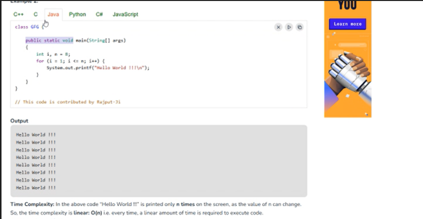
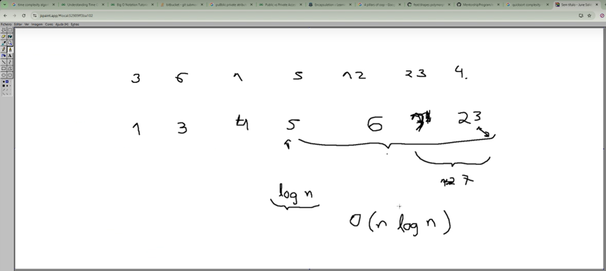

1. Classes Abstratas:

Classes abstratas em Java;
Diferença entre classes públicas e privadas;

2. Complexidade Temporal:

É uma forma de medir quanto tempo um algoritmo demora a executar, dependendo do tamanho dos dados de entrada.
A complexidade temporal não mede o tempo exato, mas sim como esse tempo cresce quando se aumenta os dados.

    O(1) → Tempo constante (rápido, não importa o tamanho dos dados).
    O(n) → Tempo cresce linearmente (ex: percorrer uma lista).
    O(n²) → Cresce rapidamente (ex: algoritmos de ordenação mais lentos).
    O(log n) → Cresce devagar (ex: pesquisa binária).

Com base neste exemplo: [ https://www.geeksforgeeks.org/understanding-time-complexity-simple-examples/ ]
    a. " Imagine a classroom of 100 students in which you gave your pen to one person. You have to find that pen without knowing to whom you gave it. 
        Here are some ways to find the pen and what the O order is.
    . O(n2): You go and ask the first person in the class if he has the pen. Also, you ask this person about the other 99 people in the classroom if they have that pen and so on, This is what we call O(n2). 
    . O(n): Going and asking each student individually is O(N). 
    . O(log n): Now I divide the class into two groups, then ask: "Is it on the left side, or the right side of the classroom?" Then I take that group and divide it into two and ask again, and so on. Repeat the process till you are left with one student who has your pen. This is what you mean by O(log n). 

I might need to do:
    . The O(n2) searches if only one student knows on which student the pen is hidden. 
    . The O(n) if one student had the pen and only they knew it. 
    . The O(log n) search if all the students knew, but would only tell me if I guessed the right side. "

    